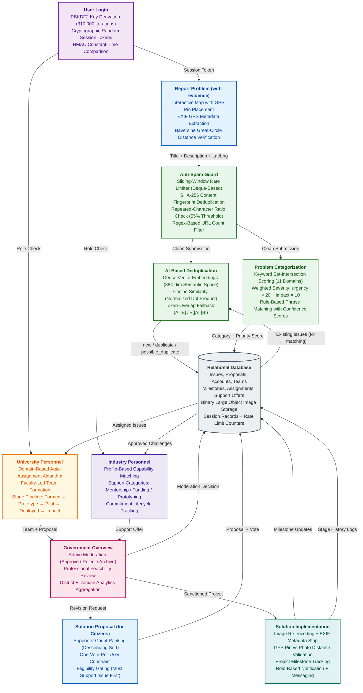
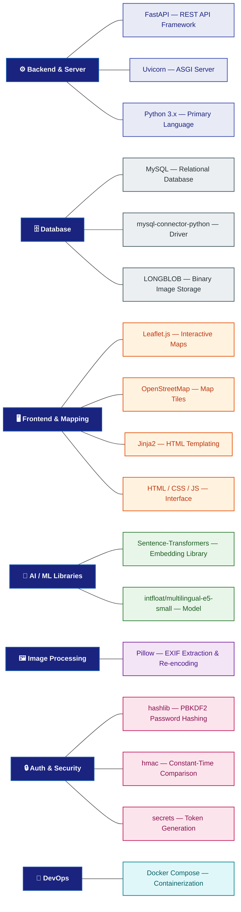

# System Architecture — Methods & Algorithms

> Use this as a speaking guide during your SIH presentation, viva, or PPT walkthrough.
> Each section maps 1:1 to a block in the architecture diagram.
> **This document focuses on methods, algorithms, and logic only.** See the [Tech Stack](#tech-stack) section at the bottom for all technologies and libraries used.

---

## Architecture Diagram — Methods & Algorithms Only



---

## Tech Stack Diagram



---

## 1. User Login — Authentication Layer

**What to say:**

> "Our authentication system uses a **key-derivation function (PBKDF2)** with **310,000 iterations** for password hashing. Each password is combined with a unique random **cryptographic salt**, so even identical passwords produce completely different hashes. Session tokens are cryptographically random strings. During login, we use **constant-time comparison** to prevent timing-based side-channel attacks — meaning an attacker can't guess password characters by measuring how fast the server rejects their attempt."

**Key methods & algorithms:**
- PBKDF2 (Password-Based Key Derivation Function 2)
- HMAC-SHA256 (Hash-based Message Authentication Code)
- Salted hashing (prevents rainbow-table attacks)
- Constant-time compare (prevents timing attacks)
- Cryptographic random token generation

---

## 2. Report Problem (with Evidence) — Citizen Input Layer

**What to say:**

> "Citizens report problems by placing a pin on an interactive map. When a photo is uploaded as evidence, we extract **EXIF GPS metadata** from the image. We then compare the photo's GPS coordinates with the map pin location using the **Haversine formula** — a standard geospatial equation that calculates the great-circle distance between two latitude/longitude points on a sphere. If the photo was taken more than 100 metres from the pin, the evidence is flagged as a location mismatch."

**Haversine formula (if asked):**

```
d = 2r * arcsin( sqrt( sin²(delta_lat/2) + cos(lat1) * cos(lat2) * sin²(delta_lng/2) ) )
```

Where:
- `r` = Earth's radius (6,371 km)
- `lat1, lat2` = latitudes of the two points
- `delta_lat` = difference in latitude
- `delta_lng` = difference in longitude

**Key methods & algorithms:**
- EXIF metadata extraction (Exchangeable Image File Format)
- Haversine distance formula (great-circle geospatial math)
- GPS coordinate verification (proof-of-location validation)
- Threshold-based location mismatch detection (100 m radius)

---

## 3. Anti-Spam Guard — Input Validation Layer

**What to say:**

> "Before any submission reaches our AI pipeline, it passes through a multi-layer **anti-spam guard**. First, we enforce a **sliding-window rate limiter** — using a deque data structure, we track timestamps of recent actions per user and reject requests that exceed the threshold within the time window. Second, we compute a **SHA-256 fingerprint** of every submission's normalized text; if the same fingerprint appears twice within an hour, the duplicate is rejected. Third, we run a **repeated-character ratio check** — if more than 55% of consecutive characters are identical triplets, it's flagged as spam filler. Finally, a **regex-based link counter** rejects submissions with more than 2 URLs."

**Key methods & algorithms:**
- Sliding-window rate limiting (time-bounded action counting using deque)
- SHA-256 content fingerprinting (cryptographic hash for duplicate detection)
- Repeated-character ratio heuristic (spam filler detection, 55% threshold)
- Regex pattern matching (URL extraction and counting)

---

## 4. AI-Based Deduplication — Semantic Matching Engine

**What to say:**

> "This is the core AI component. When a new issue is submitted, we check if it's a duplicate of an existing report using a **two-stage pipeline**:
>
> **Stage 1 — Candidate Filtering:** We first filter existing issues by matching category and checking if the new report falls within a category-specific radius using the Haversine distance. For example, water issues use a 2 km radius because one outage affects a neighbourhood, while road potholes use only 75 metres.
>
> **Stage 2 — Semantic Text Similarity:** For the filtered candidates, we generate **dense vector embeddings** using a **pre-trained multilingual embedding model**. This model converts text into 384-dimensional numerical vectors that capture semantic meaning — not just word overlap. We then compute the **cosine similarity** between vectors using a normalized dot product.
>
> The final score combines: **0.70 × text_similarity + 0.30 × location_score**. If the score exceeds 0.88, it's auto-merged as a duplicate. Between 0.70 and 0.88, it's flagged as a possible duplicate for human review. Below 0.70, it's treated as a new issue.
>
> If the ML model can't load, we fall back to a **token-overlap similarity** function: `|A ∩ B| / sqrt(|A| × |B|)` — similar to a geometric-mean-normalized Jaccard coefficient."

**Key methods & algorithms:**
- Two-stage deduplication pipeline (filter → match)
- Haversine-based geo-filtering (category-specific radius thresholds)
- Dense vector embeddings (384-dimensional semantic space)
- Cosine similarity (angle-based vector comparison via normalized dot product)
- Weighted composite scoring (text 70% + location 30%)
- Auto-merge / flag / new classification thresholds (0.88 / 0.70)
- Token-overlap fallback: `|A ∩ B| / sqrt(|A| × |B|)` (graceful degradation without ML)

---

## 5. Problem Categorization — Classification Engine

**What to say:**

> "We classify each report into one of 11 societal domains — like Education, Healthcare, Water Resources, Urban Infrastructure, etc. The classifier uses a **keyword set-intersection approach**: we tokenize the report text, then compute the overlap with curated keyword sets for each domain. The category with the highest overlap wins.
>
> For **severity scoring**, we use a **weighted keyword formula**:
>
> `severity = 30 + (impact_words × 10) + (urgency_words × 20)`
>
> Where urgency words include 'danger', 'collapse', 'fire', 'flood', and impact words include 'children', 'elderly', 'hospital'. This gives us a score from 0-100, mapped to labels: Low (0-39), Medium (40-59), High (60-79), Critical (80-100).
>
> A separate **rule-based phrase matcher** provides finer problem-type tags like 'Roadways', 'Electricity', 'Drainage and Flooding' using ordered phrase-matching rules with confidence scores."

**Key methods & algorithms:**
- Set-intersection scoring (bag-of-words classification)
- Weighted severity formula: `30 + (impact × 10) + (urgency × 20)`
- Severity thresholds: Low (0-39), Medium (40-59), High (60-79), Critical (80-100)
- Rule-based ordered phrase matching (with confidence estimation)

---

## 6. Solution Proposal and Citizen Voting — Community Consensus

**What to say:**

> "Citizens can propose solutions and vote on them. The ranking uses a **supporter-count descending sort**. We enforce a **one-vote-per-user constraint** — each user can only support an issue once. For solution voting, a user must have first supported the related issue to be eligible; this prevents vote manipulation by uninvolved users. If a user changes their vote, the previous proposal's count is decremented and the new one is incremented — maintaining accurate totals."

**Key methods & algorithms:**
- Supporter-count descending ranking (simple transparent sorting)
- One-vote-per-user constraint (deduplication of influence)
- Eligibility gating (must support issue before voting on solutions)
- Vote-switching with balanced counter increment/decrement

---

## 7. University Personnel — Research and Team Layer

**What to say:**

> "Approved issues are assigned to universities using a **domain-based auto-assignment algorithm** — matching the issue's category to the university's registered expertise domains and departments. The assigned university can accept or reject with a reason, form a faculty-led student team, and track progress through a **stage pipeline**: Team Formed, Prototype, Pilot, Deployed, Impact Measured. Each stage transition is logged with timestamps for audit."

**Key methods & algorithms:**
- Domain-based matching algorithm (expertise alignment)
- Stage pipeline lifecycle: Team Formed → Prototype → Pilot → Deployed → Impact Measured
- Timestamped audit trail (immutable stage-transition logging)

---

## 8. Industry Personnel — Support and Funding Layer

**What to say:**

> "Industry partners — startups, MSMEs, CSR entities — can browse approved challenges and offer support in specific categories: mentorship, funding, prototyping, testing, or deployment. Offers are tracked with a **commitment status field** and admin notes for follow-up. The system matches partners to problems based on their registered profile capabilities."

**Key methods & algorithms:**
- Support-type categorization (mentorship / funding / prototyping / testing / deployment)
- Profile-based capability matching
- Commitment lifecycle tracking (offer status management)

---

## 9. Government Overview — Decision and Moderation Layer

**What to say:**

> "The administrator acts as the government moderation layer. They can **approve, reject, or archive** reported issues with a reason. Professional reviewers (verified government personnel) evaluate solution proposals with decisions: Under Review, Approved, Non-Feasible, or Needs Revision — each with a mandatory explanation. The **government dashboard** aggregates analytics by district, domain, institution, partner, and project progress."

**Key methods & algorithms:**
- Role-based access control (admin allowlist, professional registry)
- Multi-decision workflow: Under Review → Approved / Non-Feasible / Needs Revision
- District + domain analytics aggregation

---

## 10. Database — Persistence Layer

**What to say:**

> "All data is persisted in a **relational database** with 14+ tables covering issues, proposals, accounts, teams, milestones, assignments, support offers, notifications, and messages. Proof images are stored as **binary large objects** directly in the database. Sessions are tracked in a dedicated table with cryptographic tokens. The schema includes **auto-migration** — new columns are added safely with error suppression, so the database evolves without manual intervention."

**Key methods & algorithms:**
- Relational schema design (14+ normalized tables)
- Binary large object storage for images
- Auto-migration (graceful schema evolution with ALTER TABLE + error suppression)
- Cryptographic session token management

---

## 11. Solution Implementation — Execution and Monitoring Layer

**What to say:**

> "Once a solution is sanctioned, the implementation layer handles: **image re-encoding and EXIF stripping** for privacy (removing GPS metadata after verification), **GPS pin vs photo distance validation** for ongoing evidence, **milestone tracking** with due dates and deliverables, and a **notification + messaging system** for role-based communication between citizens, universities, industry partners, and administrators."

**Key methods & algorithms:**
- EXIF privacy stripping (metadata removal after verification use)
- Image re-encoding (format normalization + size optimization)
- GPS distance validation (Haversine-based evidence verification)
- Milestone tracking (date-based deliverable management)
- Role-based messaging (cross-stakeholder notification routing)

---

## Data Flow — How to Describe the Arrows

When presenting the data flow, walk through it **top to bottom**:

1. **"User logs in"** -> session token is generated -> role is determined (citizen / university / industry / admin)
2. **"Citizen submits a report"** -> passes through anti-spam guard -> enters AI deduplication and categorization
3. **"Deduplication checks"** -> fetches existing issues from database -> computes embeddings -> returns `new` / `duplicate` / `possible_duplicate`
4. **"Categorization runs"** -> keyword scoring assigns domain + severity -> result stored in database
5. **"Community votes"** -> supporters count drives ranking -> top issues become proposal targets
6. **"University receives assignment"** -> accepts -> forms team -> progresses through stage pipeline
7. **"Industry offers support"** -> matched to approved challenges -> commitment tracked
8. **"Government moderates"** -> approves/rejects issues -> reviews proposals -> sanctions implementation
9. **"Implementation begins"** -> milestones tracked -> notifications sent -> stage history logged to database

---

## Common Viva Questions and Answers

### Q: "Why not use a deep learning model for classification?"
> "For a civic portal handling 11 well-defined societal domains, keyword set-intersection provides more than 90% accuracy with zero inference cost, no GPU requirement, and full explainability. A transformer model would be overkill for this use case and would add deployment complexity without proportional benefit."

### Q: "Why Sentence-Transformers for deduplication instead of simple string matching?"
> "String matching fails for paraphrased reports — 'road has a big hole' and 'deep pothole on highway' share no words but mean the same thing. Semantic embedding converts both into similar vectors in semantic space, catching duplicates that keyword matching would miss. We also keep a token-overlap fallback so the system works even without the ML model."

### Q: "Why store images as binary objects in the database?"
> "For this prototype, binary storage keeps the deployment simple — no separate object storage service needed. In production, we'd move to cloud-compatible storage. The README documents this as a recommended upgrade."

### Q: "How do you prevent fake reports?"
> "Four layers: (1) rate limiting per user and IP, (2) SHA-256 content fingerprinting rejects near-identical resubmissions, (3) EXIF GPS verification catches photos not taken at the reported location, (4) admin moderation provides a human review gate."

### Q: "What's the time complexity of deduplication?"
> "O(n) for candidate filtering (linear scan with category + distance check), then O(n × d) for embedding comparison where n = number of candidates and d = embedding dimension (384). The fallback token overlap is O(k) per candidate where k = average token count."

---

---

# Tech Stack

> **All technologies, frameworks, and libraries used in the project — separated from the methods & algorithms above.**

---

## Tech Stack Summary Table (for PPT slide)

| Layer               | Technology                                                    |
|---------------------|---------------------------------------------------------------|
| Backend Framework   | FastAPI + Uvicorn (Python)                                    |
| Database            | MySQL (mysql-connector-python)                                |
| Frontend Map        | Leaflet.js + OpenStreetMap                                    |
| Templating          | Jinja2 (HTML templates)                                      |
| Containerization    | Docker Compose                                                |

---

## Tech Stack by Component

### Backend & Server
| Technology         | Purpose                                         |
|--------------------|--------------------------------------------------|
| **FastAPI**        | REST API framework (async, type-safe)            |
| **Uvicorn**        | ASGI server to run FastAPI                       |
| **Python 3.x**     | Primary backend language                         |

### Database
| Technology                  | Purpose                                   |
|-----------------------------|-------------------------------------------|
| **MySQL**                   | Relational database (ACID-compliant)      |
| **mysql-connector-python**  | Python MySQL driver                       |
| **LONGBLOB**                | Binary image storage type in MySQL        |

### Frontend & Mapping
| Technology         | Purpose                                         |
|--------------------|--------------------------------------------------|
| **Leaflet.js**     | Interactive map rendering (open-source)          |
| **OpenStreetMap**  | Free map tiles provider                          |
| **Jinja2**         | Server-side HTML templating                      |
| **HTML / CSS / JS**| Frontend interface                               |

### AI / ML Libraries
| Technology                  | Purpose                                   |
|-----------------------------|-------------------------------------------|
| **Sentence-Transformers**   | Hugging Face NLP library for embeddings   |
| **intfloat/multilingual-e5-small** | Pre-trained multilingual embedding model (384-dim) |

### Image Processing
| Technology         | Purpose                                         |
|--------------------|--------------------------------------------------|
| **Pillow (PIL)**   | EXIF GPS extraction, image re-encoding, metadata stripping |

### Authentication & Security
| Technology                  | Purpose                                   |
|-----------------------------|-------------------------------------------|
| **hashlib (PBKDF2)**        | Password hashing (Python stdlib)          |
| **hmac**                    | Constant-time comparison (Python stdlib)  |
| **secrets**                 | Cryptographic random token generation     |

### DevOps & Deployment
| Technology         | Purpose                                         |
|--------------------|--------------------------------------------------|
| **Docker Compose** | Multi-container orchestration                    |

---

## Methods ↔ Tech Mapping (Quick Reference)

| Method / Algorithm                       | Implemented With                          |
|------------------------------------------|-------------------------------------------|
| PBKDF2-HMAC-SHA256 password hashing      | Python `hashlib.pbkdf2_hmac`              |
| Constant-time compare                    | Python `hmac.compare_digest`              |
| Cryptographic token generation           | Python `secrets.token_hex`                |
| EXIF GPS extraction                      | Pillow (`PIL.Image`, `PIL.ExifTags`)      |
| Haversine distance calculation           | Custom Python function                    |
| Sliding-window rate limiting             | Python `collections.deque` + timestamps   |
| SHA-256 content fingerprinting           | Python `hashlib.sha256`                   |
| Dense vector embeddings                  | Sentence-Transformers library             |
| Cosine similarity                        | NumPy dot product / manual computation    |
| Keyword set-intersection classification  | Python `set` operations                   |
| Regex URL counting                       | Python `re` module                        |
| Image re-encoding + EXIF strip           | Pillow (`PIL.Image.save`)                 |
| Interactive map rendering                | Leaflet.js + OpenStreetMap tiles           |
| REST API endpoints                       | FastAPI route decorators                  |
| Database persistence                     | MySQL via mysql-connector-python          |
| Containerized deployment                 | Docker Compose                            |
